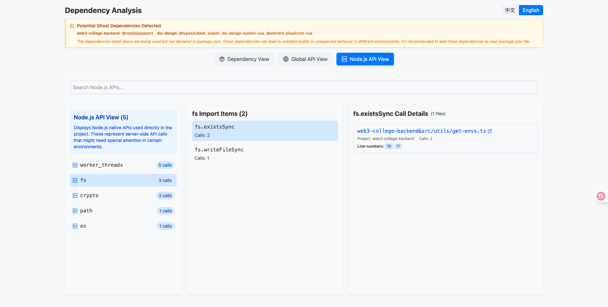

# Care  Code Analysis & Review Engine


[中文](README.md) | [English](README_EN.md)

## Features

- Check uncommitted local code files
- Inspect specified code files
- Analyze dependency, browser API and nodejs API usage patterns
- Detect ghost dependencies to ensure project stability
- Support multiple output formats
- Support configuration file management

## Installation

Please install the latest version

```bash
npm i @t-care/cli@latest -g //global installation
//or
npm i @t-care/cli@latest //local installation for npm usage
```

## Usage

### Check Uncommitted Code

```bash
care check
```

Options:
- `-d, --detailed` - Show detailed review results
- `-f, --format <format>` - Output format (text|json)
- `-m, --model <model>` - Model to use
- `--focus <focus>` - Review focus (performance|security|readability|best practices)

### Inspect Specific Files

```bash
care inspect path/to/file1.js path/to/file2.js
```

Options:
- `-d, --detailed` - Show detailed review results
- `-f, --format <format>` - Output format (text|json)
- `-m, --model <model>` - Model to use
- `--focus <focus>` - Review focus (performance|security|readability|best practices)

### Analyze Dependency Usage

```bash
care deps-analysis
```

Options:
- `-i --incremental` - Incremental analysis
- `--vue` - Scan Vue files

### Manage Configuration

Create config file:

```bash
# Create local config file (current directory)
care config --init

# Create global config file (user home directory)
care config --init global
```

View current configuration:

```bash
care config --show
```

## Examples





## Configuration

Configure the tool using one of these methods:

1. Command line parameters:
   ```
   care check --language en  # Use English output
   care inspect file.js --language zh  # Use Chinese output
   ```

2. Create default configuration:
   ```
   care config --init
   ```

## Configuration File

Configuration files use JavaScript format and are supported in the following locations (in order of priority):

1. `.carerc.js` in the project directory (JavaScript format)
2. `.care/config.js` in the project directory (JavaScript format)
3. `.carerc.js` in the user's home directory (JavaScript format)
4. `.care/config.js` in the user's home directory (JavaScript format)

### JavaScript Configuration File Example (.carerc.js)

```javascript
export default {
  openaiKey: 'your_api_key_here',
  model: 'gpt-4o-mini', //Currently only supports OpenAI models
  detailed: false,
  focus: 'all',
  excludeExtensions: ['.json', '.md'],
  language: 'en', // Language used in CLI, supports English and Chinese
  depsAnalysis: {
    scanSource: [
      {
        name: 'your-project',
        include: ['your-project/src'], // Scan paths, defaults to ts, tsx files
        exclude: ['**/node_modules/**'], // Exclude directories, optional
        httpRepo: 'https://github.com/yourusername/yourrepo', // Repository URL, optional, enables link jumping in results
        format: (str) => {
          return str.replace('your-project', '');
        }, // Format function to correct path links
        packageJsonPath: './package.json',
        tsConfigPath: './tsconfig.json',
      }
    ],
    analysisTarget: ['lodash', 'react', 'axios'], // Target dependencies, if not provided, scans all dependencies
    blackList: ['@types/*'], // Blacklisted APIs, will show warnings in scan results
    browserApis: ['localStorage', 'sessionStorage', 'navigator', 'document'], // Browser APIs to check, enter top-level APIs, e.g., window will scan window.addEventListener, if not provided, scans all apis
    isScanVue: false, // Defaults to analyzing ts, tsx files, enable to support Vue files
  }
};
```

Environment variable setting (optional, takes precedence over config file):

```bash
export OPENAI_API_KEY=your_api_key
```

## Known Issues

Cannot parse components from external dependencies used in Vue projects.

Global API detection is not perfectly accurate and may incorrectly identify APIs that are used in a project without being imported as global APIs.

## Development

### Project Structure

```
care/
├── packages/
│   ├── core/           # Core functionality module
│   ├── utils/          # Utility functions
│   ├── mastra/         # AI model integration
│   ├── deps-analysis/  # Dependency analysis module
│   ├── deps-display/   # Dependency analysis visualization
│   └── cli/            # Command line tool
├── rollup.config.js    # Build configuration
└── package.json
```

### Build

```bash
pnpm build
```

### Development

```bash
pnpm dev
```

## License

ISC
